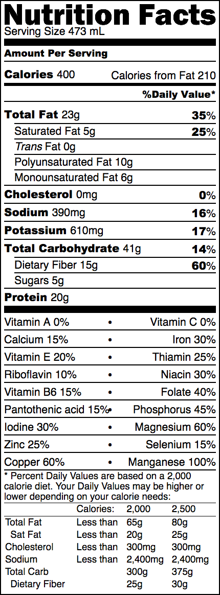

# pbean

*A simple, healthy, and convenient vegan meal.*

## Recipe

The following recipe, [based on the solution to a linear program](pbean.ipynb), makes one serving.

### Ingredients

* 42 g soybeans; soaked
* 24 g peanut butter (peanuts should be the only ingredient)
* 15 g cocoa powder
* 8 g chia seeds (5 g ground, 3 g whole)
* 1 g iodized salt

### Directions

1. cook beans until soft
2. blend all ingredients
3. dilute to 2 cups
4. refrigerate for up to six days

## Tips

### Equipment

* pressure cooker
* immersion blender
* funnel
* half-gallon jugs
* coffee grinder
* bucket, for mixing

### Flavors

* good: vanilla, mint, coffee, coconut
* okay: pumpkin pie spice
* bad: strawberry, banana

### Additives

* citric/lactic acid - just in case you want to pretend you're drinking kefir
* sunflower lecithin - helps keep phases mixed while bottling and serving

## FAQ

* Can I drink pbean and nothing else? No. You must supplement it with at a few leaves of kale (or other Brassica) to get the RDA of vitamins A, C, and K.
* Can I use other nut butters? Yes, but the flavor will not change much.
